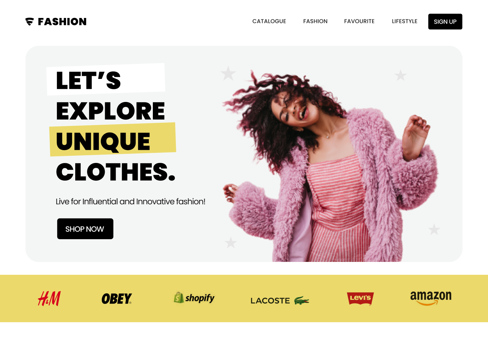
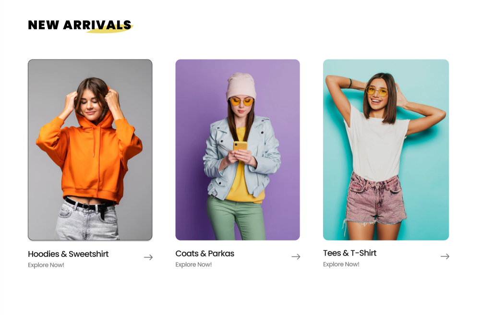
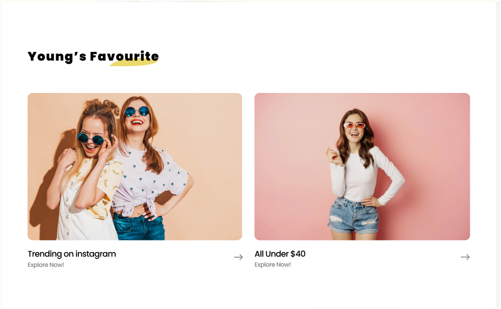
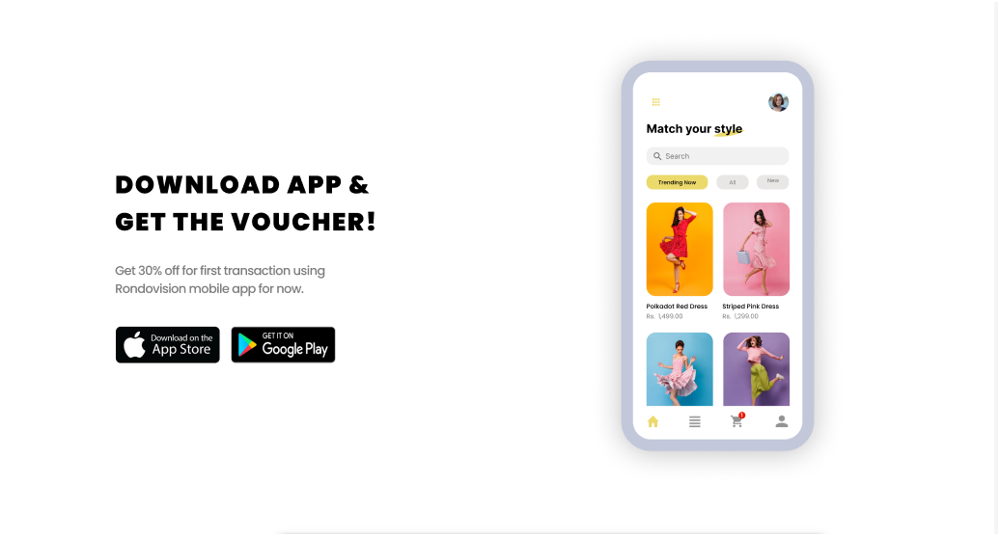
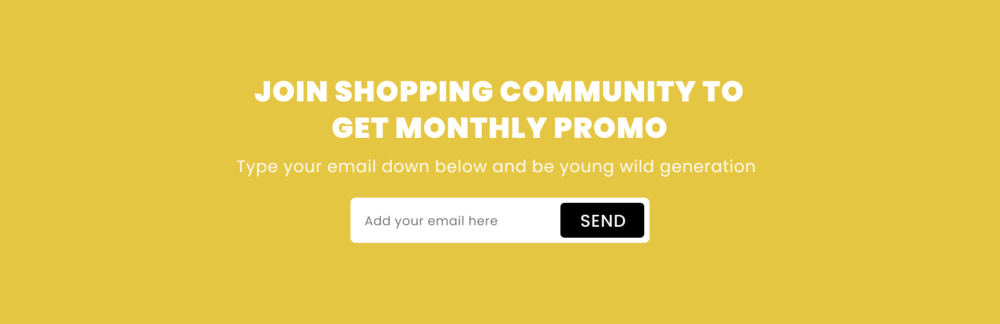

# ShopCommunity

A fully responsive (in-progress) **E‑commerce Frontend Website** built with **HTML, CSS, and JavaScript**, designed based on modern Figma UI concepts.

This project is ideal for learning frontend development, practicing layout building, and understanding the structure of a real-world shop UI.

---

## 🚀 Features

- Responsive layout (ongoing improvements)
- Modern UI based on Figma design
- Clean folder structure
- Hero section, product cards, banners, footer
- Easy to customize and extend

---

## 🔗 Live Demo

[https://fluffy-profiterole-a2aab8.netlify.app/](https://fluffy-profiterole-a2aab8.netlify.app/)

> ⚠️ **Note:** This version is **not fully responsive yet** and will be improved.

---

## 🖼️ Screenshots
  
  
  
  
  
  
  
_Overview of the website layout and design_

---

## 📁 Project Structure


---

## 📁 Project Structure

[https://fluffy-profiterole-a2aab8.netlify.app/](https://fluffy-profiterole-a2aab8.netlify.app/)

---

## 📁 Project Structure

```
ShopCommunity/
│── index.html
│── assets/
│   ├── css/
│   │   └── style.css
│   ├── js/
│   │   └── main.js
│   ├── images/
│   └── fonts/
│── README.md
```

---

## 🛠️ Getting Started

### 1. Clone the repository

```bash
git clone https://github.com/00mohammad/ShopCommunity.git
```

### 2. Open the project

Simply open the `index.html` file in your browser.

---

## 🎨 Customization

You can change styles and behavior:

- **CSS:** `assets/css/style.css`
- **JavaScript:** `assets/js/main.js`
- **Images:** `assets/images/`

---

## 📌 Roadmap

- [ ] Full mobile responsiveness
- [ ] Add animations
- [ ] Add real product data
- [ ] Improve UI accessibility

---

## 🤝 Contributing

Feel free to fork this project and submit pull requests.

---

## 📄 License

This project is for **learning and educational purposes**. You may freely use or modify it.
